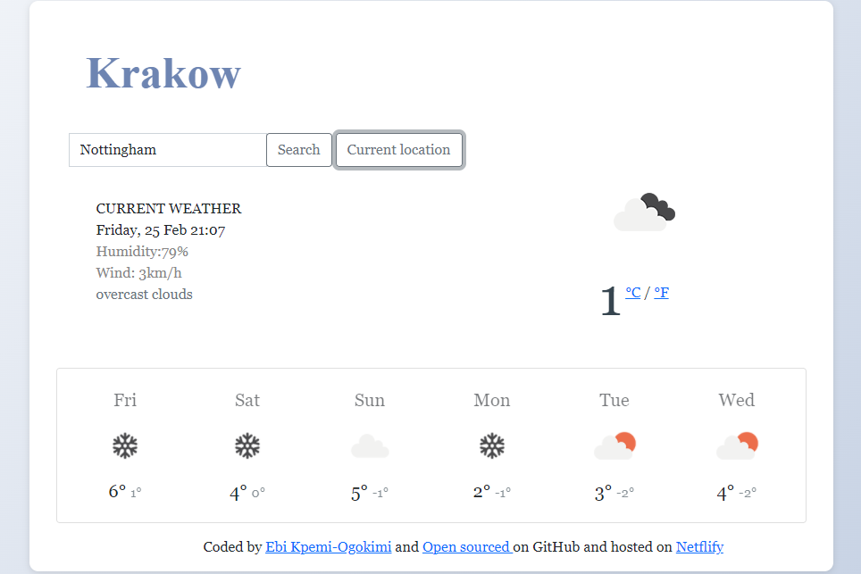

# Weather App

This is my final project for the SheCodes Plus class [SheCodes](hhttps://www.shecodes.io/). 

## Table of contents

- [Overview](#overview)
  - [The challenge](#the-challenge)
  - [Screenshot](#screenshot)
  - [Links](#links)
- [My process](#my-process)
  - [Built with](#built-with)
  - [What I learned](#what-i-learned)
  - [Continued development](#continued-development)
  - [Useful resources](#useful-resources)
- [Author](#author)

## Overview

### The challenge

Users should be able to:

- Search any City 
- Get current weather date humidity
- Get the current date & time
- Get the humidity
- Get the wind
- Get the weather description and 6-day forecast.
- Be responsive 
### Screenshot

### Links

- Live Site URL: [https://weather-ebi-app.netlify.app/]

## My process

I built a fully functional weather application with the use of API integration from Open weather App where you can search for any city or getting the current weather of your current location by clicking the 'Current location button'.  I started by creating the structure of the page using HTML. This began with creating the container, putting in some fake datas to replicate what i wanted. Created the grid using flexbox. I then styled the page using css then i went in with Javascript by declaring the variables for date, day, month and time. Created a function for the search engine while also changing the innerHTML to the search input. I converted the Celsius and Fahrenheit. next, while also creating functions to display them and pull geolocation and diaplay the 6-day forecast. I lastly created a function to display the main temperature. 

### Built with

- Semantic HTML5 markup
- CSS custom properties
- Flexbox
- CSS Grid
- Mobile-first workflow
- Javascript 
- API

### What I learned

I learned how to use API from scratch, more on using JS functions. Adding a block of html code to javascript and looping it to create a 6-day forecast. Learned how to select an object array in an api. 

### Continued development

Creating more projects that uses api to further develop my knowledge and practice more on looping, Javascript functions and callbacks. 
I made some mistakes at first with class names which i intend studying [CSS Guidelines](https://cssguidelin.es/) to help get better at it. 
I also have a major problem with git commits which i also intend using [How to write a Git commit](https://cbea.ms/git-commit/) to help get better at it. 

### Useful resources

- [Open weather App API](https://openweathermap.org/api) - I pulled Api from this site, for current weather and forecast. 
- [Axios](https://www.axios.com/) - I used this to fetch the APi and perform HTTP request
- [How to write a Git commit](https://cbea.ms/git-commit/) - To learn how to properly write commit messages.
- [CSS Guidelines](https://cssguidelin.es/) - To learn more about CSS

## Author

- Website - [Ebi Kpemi-Ogokimi](https://ebi-kpemi-ogokimi.netlify.app/)
- LinkedIn- [Ebi Kpemi-Ogokimi](https://www.linkedin.com/in/ebi-kpemi-ogokimi/)
- Twitter - [lifewithebi](https://twitter.com/lifewithebi)

